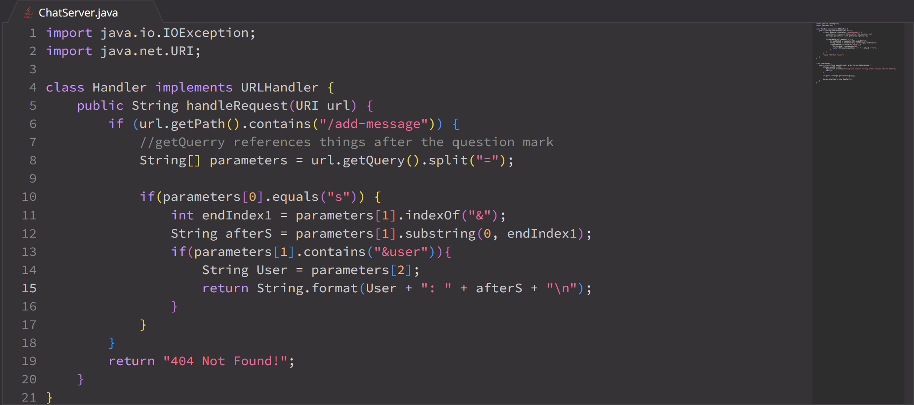
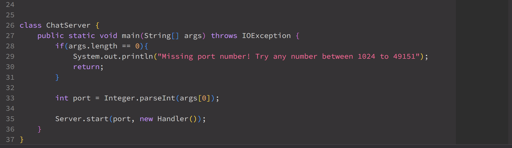
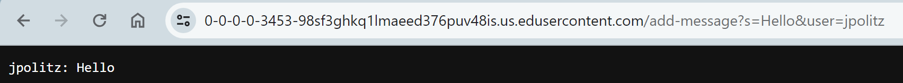

# Lab Report 2
By Angelica Cabusi (A17948600)\
CSE15L Joseph Politz


## `Chat Server`
__ChatServer Code:__\



__/add-message Commands:__ \

- Called methods:\
    1) ```
       Integer.parseInt(); NOOT THIS
       ```
        a) 
- Change


- The called methods are:
- Relevent arguments asdasd
- Change

