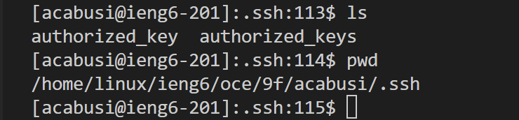

# Lab Report 2
By Angelica Cabusi (A17948600)\
CSE15L Joseph Politz


## `Chat Server`
__ChatServer Code:__\


__/add-message Commands:__ \

- Called methods:
    1) ```
       .getPath()
       ```
        a) This method does not take any parameters and is called upon a URI type variable (```url```), therefore, there are no relevant arguments. The ```url``` variable contains the string ```"/add-message?s=Hello&user=jpolitz"```. The```chatHistory``` string variable was initial ized during the server's creation.
    2) ```
       .contains()
       ```
       a) The relevant argument is ```"/add-message"```. If the path from ```.getpath``` contains the argument, then the conditional statement will pass.\
       b) The method is called again later upon ```parameters[1]``` with the relevant parameter: ```"&user"```. If this is true, the 'if' conditional will pass.
    4) ```
       .getQuery()
       ```
       a) This method does not take any parameters and is called upon a ```url```. This returns a string that will later be stored in the ```parameters``` string array variable after executing the following ```.split()``` method.
    5) ```
       .split()
       ```
       a) The relevant argument for ```.split()``` parameters is ``"="``. This will split the called upon string into different strings separated by the "=" string. Therefore, the ```parameters``` variable will now have the array ```{"s", "Hello&user", "jpolitz"}```.
    6) ```
       .equals()
       ```
       a)The relevant argument for this method is ``"s"``. This checks the called upon string(```parameters[0]```) if it is "s", and will pass if true. 
     6)```
       .indexOf()```
       a)The relevant argument for this method is ```"&" ``` since the string between s= and user= is ``"&"``. This changes the int variable, ```endIndex1```, to 5 since the method is called upon ```parameters[1]``` which is ```"Hello&user"```.
    7) ```
       .substring()
       ```
       a)The relevant argument for this method is (0, ```endIndex1```). Which initializes the ```afterS``` string variable (```afterS```) with ```"Hello"```.
    8) Once, the if conditional is passed, the ```User``` string variable will be initialized to "jpolitz".
    9) ```chatHistory``` will now contain the string value ```"jpolitz: Hello"```.
       
- Changes in fields' values:
    1) ```String[] parameters```: will contain the string values ```{"s", "Hello&user", "jpolitz"}```.
    3) ```int endIndex1```: will contain the int value ```5``` due to the .indexOf("&") method.
    4) ```String afterS```: will contain the string "Hello" due to the .substring(0, ```endIndex1```) method call.
    5) ```String User```: will contain the string ```"jpolitz"``` due to ```parameter[2]``` being assigned to it.
    6) ```String chatHistory```: will now contain the string ```""jpolitz: Hello"  +"\n""```.

  

- Called methods:
    1) ```
       .getPath()
       ```
        a) This method does not take any parameters and is called upon a URI type variable (url), therefore, there are no relevant arguments. The ```url``` variable contains the string ```"/add-message?s=How%20are%20you&user=yash"```. The ```chatHistory``` string variable was initialized during the server's creation.
    2) ```
       .contains()
       ```
       a) The relevant argument is ```"/add-message"```. If the path from ```.getpath``` contains the argument, then the conditional statement will pass.\
       b) The method is called again later upon ```parameters[1]``` with the relevant parameter: ``"&user"```. If this is true, the 'if' conditional will pass.
    3) ```
       .getQuery()
       ```
       a) This method does not take any parameters and is called upon a ```url```. This returns a string that will later be stored in the ```parameters``` string array variable after executing the following ```.split()``` method.
    5) ```
       .split()
       ```
       a) The relevant argument for ```.split()``` parameters is ```"="```. This will split the called-upon string into different strings separated by the "=" string. Therefore, the ```parameters``` variable will now have the array ```{"s", "How+are+you&user", "yash"}``` (The "+" is added in between because the browser added "%20" in between the spaces).
    6) ```
       .equals()
       ```
       a)The relevant argument for this method is ``` "s"```. This checks the called upon string(```parameters[0]```) if it is "s", and will pass if true. 
     7)```
       .indexOf()```
       a)The relevant argument for this method is ```"&" ``` since the string between s= and user= is ```"&"```. This changes the int variable, ```endIndex1```, to ```11``` since the method is called upon ```parameters[1]``` which is ```"How+are+you&user"```.
    8) ```
       .substring()
       ```
       a)The relevant argument for this method is (0, ```endIndex1```). Which changes the ```afterS``` string variable  to ```"How+are+you"```.
    9) Once, the if conditional is passed, the ```User``` string variable will change to ```"yash"```.
    10) ```chatHistory``` will now contain the string value ```""jpolitz: Hello" +"\n" + "yash: How+are+you"  +"\n""```.
       
- Changes in fields' values:
    1) ```String[] parameters```: will contain the string values ```{"s", "How+are+you&user", "yash"}```.
    3) ```int endIndex1```: will contain the int value ```11``` due to the .indexOf("&") method.
    4) ```String afterS```: will contain the string "How+are+you&user" due to the .substring(0, ```endIndex1```) method call.
    5) ```String User```: will contain the string ```"yash"``` due to ```parameter[2]``` being assigned to it.
    6) ```String chatHistory```: will now contain the string ```""jpolitz: Hello" +"\n" + "yash: How+are+you"  +"\n""```.

***
## `Part 2`
__private SSH key:__\


__public SSH key:__\


__terminal interaction:__\


***
## `Part 3`
__Reflection:__\
    Some things that I learned from the labs were how URL/URI paths work and that there are imported methods that can be used specifically for URls, such as ```.getQuery``` and ```.getPath()```. From that, I found the reason the "?" symbol is embedded  in some URLs. Most importantly, I found out the "/" symbol in URLs in general even means, which is the path or gives the computer the directions for the server's navigation toward a specific file.
