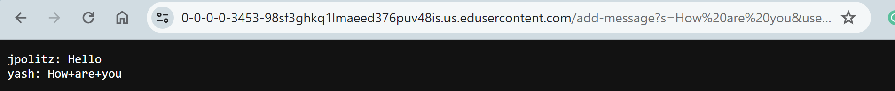

# Lab Report 2
By Angelica Cabusi (A17948600)\
CSE15L Joseph Politz


## `Chat Server`
__ChatServer Code:__\


__/add-message Commands:__ \

- Called methods:\
    1) ```
       .getPath()
       ```
        a) This method does not take any parameters and is called upon a URI type variable (url), therefore, there are no relevant arguments. Chat history was initialized during the server's creation.
    2) ```
       .contains
       ```
       a) The relevant argument is "/add-message". If the path from ```.getpath``` contains the argument, then the conditional statement will pass.
    3) ```
       .getQuery()
       ```
       a) This method does not take any parameters and is called upon a URI type variable. This returns a string that will later be stored in the ```parameters``` string array variable after executing the following ```.split()``` method.
- Change


- The called methods are:
- Relevent arguments asdasd
- Change

