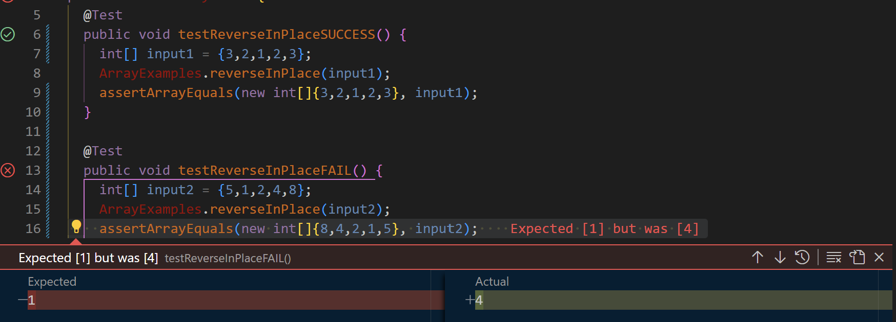

# Lab Report 3
By Angelica Cabusi (A17948600)\
CSE15L Joseph Politz\
February 23, 2024
## `Part 1 - Bugs`
__Testing ArrayExamples.java(buggy program): reverseInPlace() Method:__\

* Failure-inducing input:
```
@Test
public void testReverseInPlace() {
    int[] input1 = {5,1,2,4,8};
    ArrayExamples.reverseInPlace(input1);
    assertArrayEquals(new int[]{8,4,2,1,5}, input1);
}
```
* Successful input:
```
@Test
public void testReverseInPlace() {
    int[] input2 = {3,2,1,2,3};
    ArrayExamples.reverseInPlace(input2);
    assertArrayEquals(new int[]{3,2,1,2,3}, input2);
}
```
* Symptoms: 


\

* Buggy Code:
    1. Before:
    ```
    static void reverseInPlace(int[] arr) {
        for(int i = 0; i < arr.length; i += 1) {
          arr[i] = arr[arr.length - i - 1];
        }
    }
    ```
    2. After:

    ```
    static void reverseInPlace(int[] arr) {
      int[] changedArray  = new int[arr.length];
        for(int i = 0; i < arr.length; i += 1) {
          changedArray[i] = arr[arr.length - i - 1];
        }
        arr = changedArray; 
    }
    ```

*Explanation:*\
The buggy code under "Before;" above reverses the array values perfectly for the first [few] values until a certain point (usually the middle value of the array). The issue is that once `i` reaches an index where the latter `(arr[arr.length - i - 1])` refers to an index whose value has already been changed, the call will refer to a reversed value rather than the intended value from the inputted array. Meaning that the first part of the array will be reversed while the later values of the array will have the same values as the now reversed value of the array, because the original inputted array value are not preserved.\
By making a new array, in this case it is a `changedArray`, we can save and refer to the original values of the inputted array. Now, `changedArray` will be the same size as the original array but empty and then filled (one-by-one) with the reversed value of the original array. We do this by referring to the last value of the original `arr` array and assigning it to the beginning of the `changedArray` and then iterating through each index where `changedArray`'s index is moving forward and the index value of `arr` is moving backward. Finally, `changedArray` will replace the inputted `arr` array as intended.

---

## **Part 2 - Researching Commands: Researching the `find` Command**
> *These are all working in the .technical/ directory.*


**`-type command:`**

* Ex1) input:
```
 find -type d
```
* Ex1) output:
```
./911report
./biomed
./government
./government/About_LSC
./government/Alcohol_Problems
./government/Env_Prot_Agen
./government/Gen_Account_Office
./government/Media
./government/Post_Rate_Comm
./plos
```
*Explanation:*\


* Ex2) input:
```
 find -type f
```
* Ex2) output:
    1.  (Following displays a truncated output but essentially lists all files within the directory)
```
./plos/pmed.0020238.txt
./plos/pmed.0020239.txt
./plos/pmed.0020242.txt
./plos/pmed.0020246.txt
./plos/pmed.0020247.txt
./plos/pmed.0020249.txt
./plos/pmed.0020257.txt
./plos/pmed.0020258.txt
./plos/pmed.0020268.txt
./plos/pmed.0020272.txt
./plos/pmed.0020273.txt
./plos/pmed.0020274.txt
./plos/pmed.0020275.txt
./plos/pmed.0020278.txt
./plos/pmed.0020281.txt
```
*Explanation:*\


**`-empty command:`**
* Ex1) input:
```
 find -empty
```
* Ex1) output:
```
./AccidentalEmpty.txt
```

*Explanation:*\

* Ex2) input:
```
 find -empty
```
* Ex2) output:
```
./AccidentalEmpty.txt
./newDirectoryIMade
```

*Explanation:*\


**`-newer command:`**
* Ex1) input:
```
 find -newer AccidentalEmpty.txt
```
* Ex1) output:
```
./newDirectoryIMade
```

*Explanation:*\

* Ex2) input:
```
 find -newer plos
```
* Ex2) output:
```
.
./AccidentalEmpty.txt
./newDirectoryIMade
```

*Explanation:*\


**`-size command:`**
* Ex1) input:
```
 find -size +200k
```
* Ex1) output:
```
./911report/chapter-13.4.txt
./911report/chapter-13.5.txt
./911report/chapter-3.txt
./government/About_LSC/commission_report.txt
./government/Env_Prot_Agen/bill.txt
./government/Gen_Account_Office/d01591sp.txt
./government/Gen_Account_Office/GovernmentAuditingStandards_yb2002ed.txt      
./government/Gen_Account_Office/pe1019.txt
./government/Gen_Account_Office/Statements_Feb28-1997_volume.txt
```

*Explanation:*\

* Ex2) input:
```
 find -size -1M
```
* Ex2) output:
```
./911report
./AccidentalEmpty.txt
./biomed
./government
./government/About_LSC
./government/Alcohol_Problems
./government/Env_Prot_Agen
./government/Gen_Account_Office
./government/Media
./government/Post_Rate_Comm
./newDirectoryIMade
./plos
```

*Explanation:*\


## `Sources Used:`
https://www.computerhope.com/unix/ufind.htm
