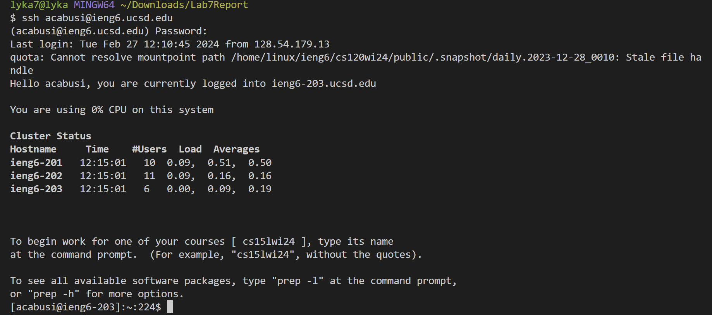
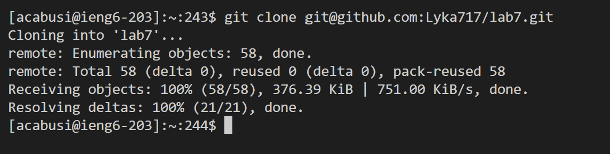
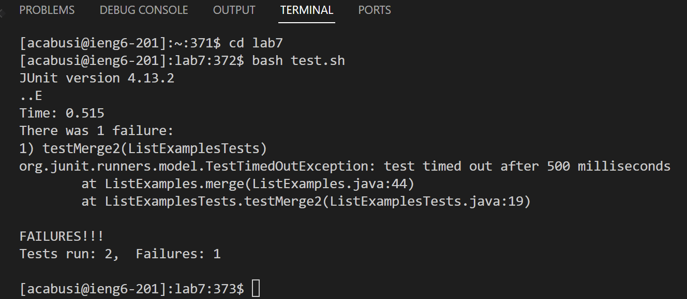
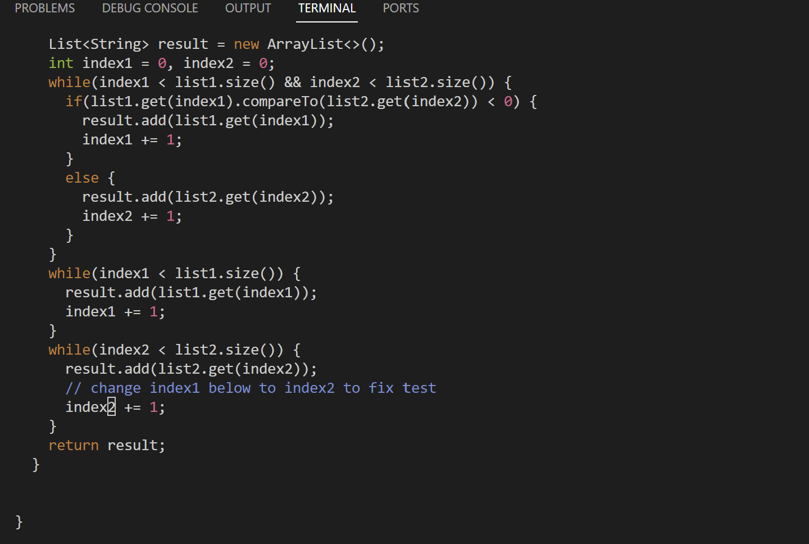
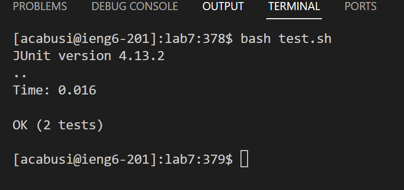
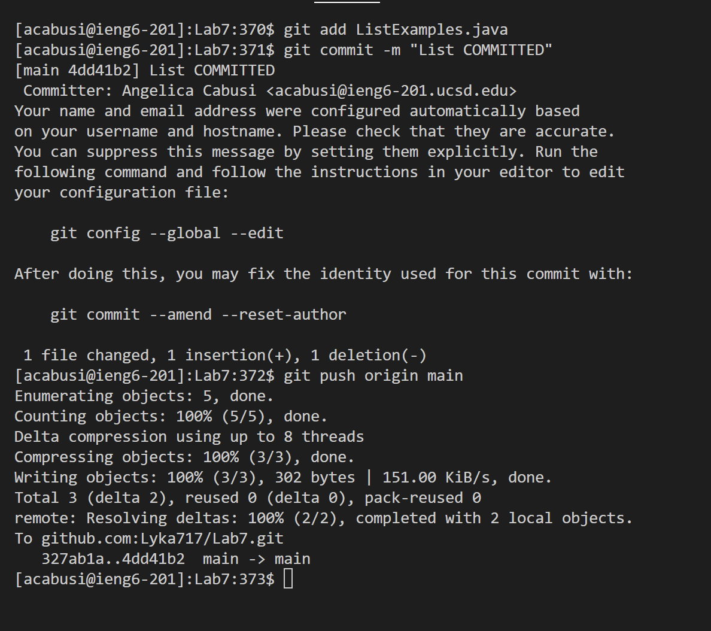

# Lab Report 4
By Angelica Cabusi (A17948600)\
CSE15L Joseph Politz\
February 27, 2024
## `Step 4)`

Keys Pressed: `<up><enter>`
  - The `ssh acabusi@ieng6.ucsd.edu` command was one of the most recent commands I used, so the `<up>` arrow key on my keyboard allowed me to access the command , then pressing `<enter>` ran the recently used command.

## `Step 5)`

Keys Pressed: (After going to github and copying the lab7 repository with ssh URL to my clipboard and went back to VSCode) `g` `i` `t` `<space>` `c` `l` `o` `n` `e` `<space>` `Crtl+P``<enter>`
  - After copying the forked repository's URL, I used the above keys to type `git clone `, then used `Crtl+p` to paste what is on the clipboard which is `https://github.com/Lyka717/lab7.git`, and finally pressed `<enter>` to run the command in the terminal.

## `Step 6)`

Keys Pressed: `c` `d` `<space>` `l` `a` `b` `7` `<enter> ` `b` `a` `s` `h` `<space>` `t` `e` `s` `t` `.` `s` `h` `<enter>`
  - I typed `cd lab7` in the terminal and pressed enter to run the command. `cd` means to "change directory" from my current working directory (home) to the following directory, which is `lab7`. Changing directories allows me to access the files within lab7. Then I typed `bash test.sh` and pressed `enter` to run the typed command. `bash` is a command used to run shell (.sh) files. Thus meaning this command lets me run what is written in the `test.sh` file which is compiling and running the program.

## `Step 7)`

Keys Pressed: `v` `i` `m` `<space>` `L` `i` `s` `t` `E` `x` `a` `m` `p` `l` `e` `s` `.` `j` `a` `v` `a` `<enter>`  `4` `4` `g` `g` `e` `r` `2` `<esc>` `:` `w` `q` `<enter>`
  - The above first types out the command `vim ListExamples.java` (then pressing `enter` to run the command). `vim` is a text editor in Unix that helps programmers edit the text within different files all from the terminal. Thus `vim ListExamples.java` allows me to edit and open the `ListExamples.java` file. While in vim's command mode (by default) I type `4` `4` `g` `g` , `44` refers to line number and `gg` mean to make your cursor go to that line, so my cursor jumped to line 44, which is the line `index1 += 1;`. Then I typed `e` because `e` makes the cursor move to the end/last character of the first word, meaning that the cursor is at "1" of "index1". Next I typed `r` then `2`. `r` means to replace, which deletes the character the cursor is on, and `2` is the desired character I want to replace "1" with to fix the program. Now that editing the text is done, I pressed `<esc>` which allows me to enter command mode again in vim, and then entered `:` `w` `q` `<enter>` where `:wq` allows me to save the now edited text and exit.

## `Step 8)`

Keys Pressed: `<up>` `<up>` `<enter>`
  - Since I used the `bash test.sh` command before entering the `vim ListExamples.java` command into the terminal, I can press the up arrow twice: `<up>` `<up>` `<enter>` to access the command since it was two commands up in the history.

## `Step 9)`

Keys Pressed: 
* `g` `i` `t` `<space>` `a` `d` `d`  `<space>` `L` `i` `s` `t` `E` `x` `a` `m` `p` `l` `e` `s` `.` `j` `a`  `v` `a` `<enter>`
* `g` `i` `t` `<space>` `c` `o` `m` `m` `i` `t` `<space>` `-` `m` `<space>` `"` `L` `i` `s` `t` `<space>` `C` `O` `M` `M`  `I` `T` `E` `D` `<enter>`
* `g` `i` `t` `<space>` `p` `u` `s` `h` `<space>` `o` `r` `i` `g` `i` `n` `<space>` `m` `a` `i` `n` `<enter>` 
  - In the above, the first command I typed was `git add ListExamples.java` (then `enter` to run the command). `git add` adds the following changed file to the "staging area" where it is essentially used to load changed files for the next command `git commit` to update these changes to the project's history.
  - The next command typed is `git commit -m "List Commited"` (then `enter` to run the command). The `git commit` command essentially saves the edited files in the staging area to the project's history. Then the following `-m` means message, meaning that the following string: `"List Commited"` is the message printed out if the `git commit` successfully runs.
  - The final command I typed is `git push origin main` (then `enter` to run the command). The `git push` command is meant to upload the current repository to the remote repository/the origin, which is on GitHub since the cloned repository is from a GitHub URL. Then by following with `origin main` then this `git push origin main` essentially means to upload the current repository (which now has a changed file through committing the change) to the `origin` of the repository (GitHub) from `main` which is local repository I have been editing and running commands on.
