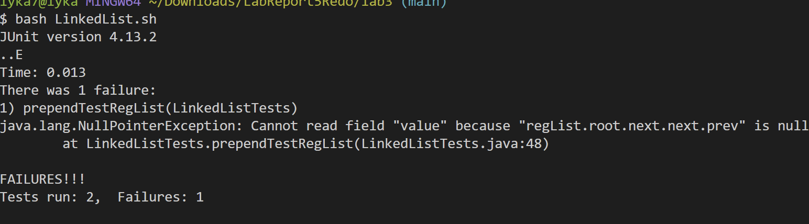
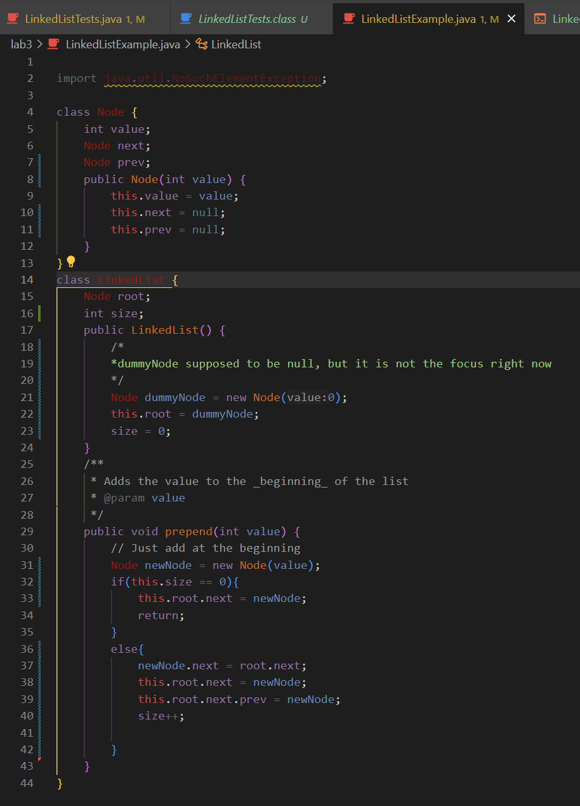
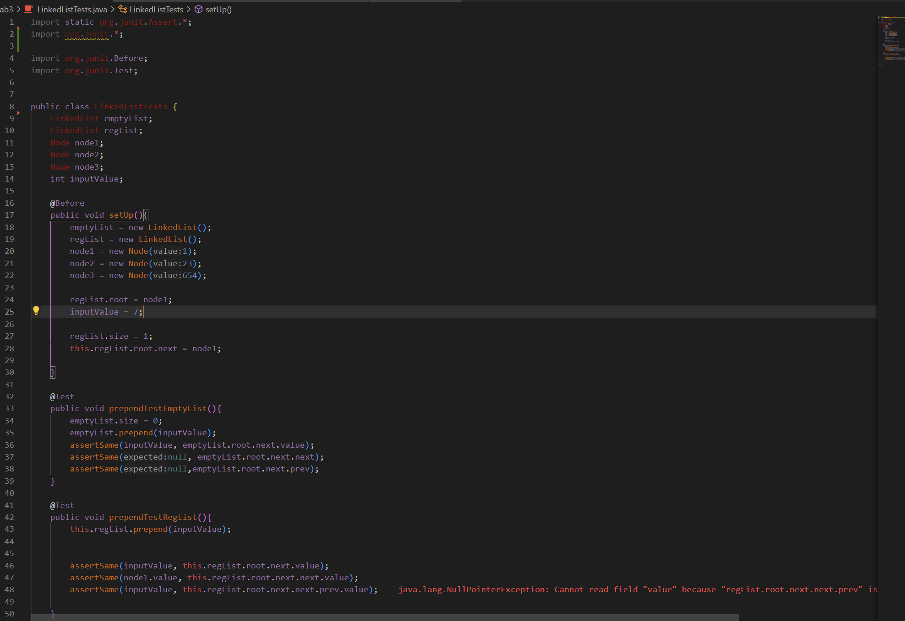

# Lab Report 5
By Angelica Cabusi (A17948600)\
CSE15L Joseph Politz\
March 10, 2024
## `Part 1 -Debugging Scenario)`
**```LinkedList Prepending Help post#7679```**
> **Dhan Cerillo:**\
> Hi, I am having an issue with my code for lab3 but I swear my logic is right. I think I did my tester wrong or I need to assign ```root.next.next.prev``` to the new Node directly? I think I am having more of an issue with the original first node of the list because my test for the new node's expected `.next` node passed fine.\


> **TA (Anonymous):**\
> Hi Dhan,\
> I see you are having trouble with a part of this week's programming, could you please provide some snippets of your code so I can better understand your issue?\

> **Dhan Cerillo:**\
> Here is the code:
> \
> Here is the tester:
> \

> **TA (Anonymous):**\
> Perfect, I see the issue. 


## `Part 2 -Reflection)`
There were numerous things that I only recently learned throughout these labs since they mainly focused on what you can do within the terminal that I have never really considered. This is because I have only been working in files of writing code for something to work instead of finding uses for what the terminal can do besides just compiling and running. But in terms of the second half of this quarter, the topics I favored/enjoyed learning the most were using `vim` and some `git` commands that allowed me to easily edit code and then automatically save that code instead of needing to do a complicated process of saving, creating, and deleting. Which I find the two being the most helpful and easy-to-understand topics to learn for the second half of the quarter, I still have trouble understanding how to exactly use jdb and code for analyzing output data. But still, I found the class very useful because although it is not used as much for my other CSE classes this quarter, I probably would have I hard time figuring out why my java file is not running instead of seeing the issue that I needed to `cd` to the actual directory (╥ᆺ╥；). 
