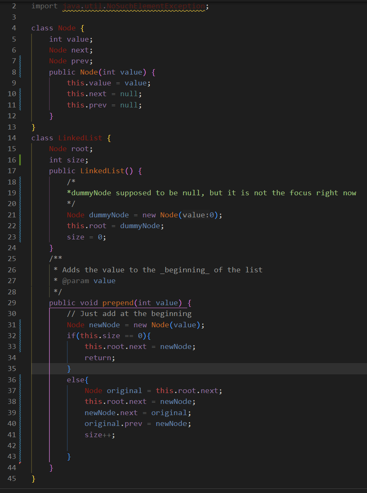
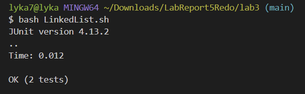
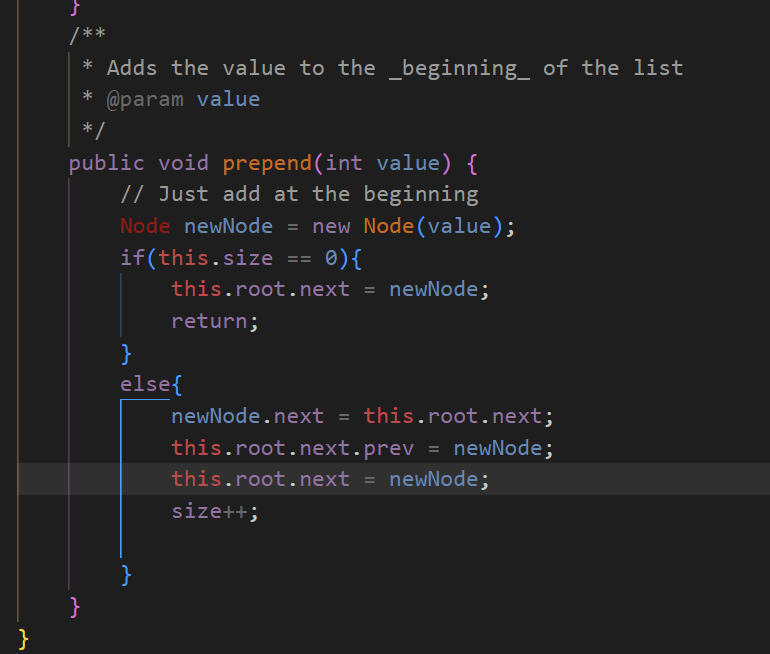
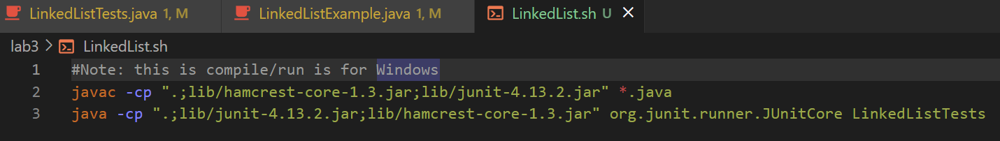

# Lab Report 5
By Angelica Cabusi (A17948600)\
CSE15L Joseph Politz\
March 12, 2024
## `Part 1 -Debugging Scenario`
**```LinkedList Prepending Help post#7679```**
> **Dhan Cerillo:**\
> Hi, I am having an issue with my code for lab3 but I swear my logic is right. I think I did my tester wrong or I need to assign ```root.next.next.prev``` to the new Node directly? I think I am having more of an issue with the original first node of the list because my test for the new node's expected `.next` node passed fine.\


> **TA (Anonymous):**\
> Hi Dhan,\
> I see you are having trouble with a part of this week's programming, could you please provide some snippets of your code so I can better understand your issue?

> **Dhan Cerillo:**\
> Here is the code:
> \
> Here is the tester:
> 

> **TA (Anonymous):**\
> Perfect, I see the issue. I believe it helps if you draw out the process of your prepend method. How do you keep track that you are referring to the original first node of the linked list? Are you connecting each node correctly/properly?

> **Dhan Cerillo:**\
> OHHH, I think I see the issue, my ordering was wrong when I'm assigning each node's `next` and `prev` nodes.
>  \
>  \
> Thank you!!! So I accidentally was referring to the newly added node's `.prev` value when assigning it to the new node instead of the original first node, since I already assigned the `root.next` node of the list to the newly added node. Creating an actual temporary node to refer to the original first node helped a lot with understanding the order. With that, I tried another way without needing to create a temporary variable and it seems to work as well.
> \
> thank you!

---
**File & directory structure:**
- `lab3` (directory)
  - `lib` (directory)
    - `hamcrest-core-1.3.jar`
    - `junit-4.13.2.jar`
  - `LinkedListExample.java`
  - `LinkedListTests.java`
  - `LinkedList.sh`

**Files _Before_ Bug Was Fixed:**
- `LinkedListExample.java`
  - 
- `LinkedListTests.java` 
  - 
- `LinkedList.sh`
  - 

**Command Lines to Trigger the Bug (located in bash file (LinkedList.sh)):**  (windows)
- `javac -cp ".;lib/hamcrest-core-1.3.jar;lib/junit-4.13.2.jar" *.java`
- `java -cp ".;lib/junit-4.13.2.jar;lib/hamcrest-core-1.3.jar" org.junit.runner.JUnitCore LinkedListTests`

**What to Edit to Fix the Bug:**
- In the prepend method, rearrange the ordering when connecting the new node in the `else` bracket. First, assign the new node's `next` to the original first node (`this.root.next`) of the linked list. Then assign the root's original first node's `prev` to the newly added node. (It does not matter which of these two steps above are done first since it is not impacting `this.root.next`'s value yet). **Lastly,** assign the head(`root.next`) of the linked list to the newly added node.


## `Part 2 -Reflection`
There were numerous things that I only recently learned throughout these labs since they mainly focused on what you can do within the terminal that I have never really considered. This is because I have only been working in files of writing code for something to work instead of finding uses for what the terminal can do besides just compiling and running. But in terms of the second half of this quarter, the topics I favored/enjoyed learning the most were using `vim` and some `git` commands that allowed me to easily edit code and then automatically save that code instead of needing to do a complicated process of saving, creating, and deleting. Which I find the two being the most helpful and easy-to-understand topics to learn for the second half of the quarter, I still have trouble understanding how to exactly use jdb and code for analyzing output data. But still, I found the class very useful because although it is not used as much for my other CSE classes this quarter, I probably would have a hard time figuring out why my java file is not running instead of seeing the issue that I needed to `cd` to the actual directory (╥ᆺ╥；). 
