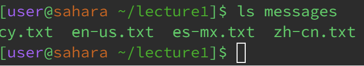

Week-1-Lab-Report\
By: Angelica Cabusi (A17948600)\
CSE15L Joseph Politz
=========
---

## `cd Commands`
__No Arguments:__\

- Working directory when the command was run: **lecture1**
- Output: Not an error\
The files system contains two directories, named _lecture1_ followed _messages_ (the messages directory is within the lecture1 directory), and within the messages directory there are multiple text files.
In the terminal, when using the cd command with no argument your changed directory defaults to the top directory (~), instead of a specific directory to input commands from, where it can only change to the next directory below it, which is the lecture1 directory
in this case.

__Directory Argument:__\

- Working directory when the command was run: **~**
- Output: Not an error\
Unlike having no argument, where no path is linked with doing the cd command, by having a directory be an argument then the directory you are operating on will be changed to the specified directory in the argument.
However, this command only works for directories that are directly under the current directory because in the file system, in this case, the _messages_ directory is within the lecture1 directory so it cannot be
accessed from the ~ directory that is above the lecture1 directory.

__File Argument:__\

- Working directory when the command was run: **lecture1/messages**
- Output: Error
  - (Why: cy.txt is a text file, not a directory, and the change directory(cd) command can work if the argument is a directory.)\

In the filesystem, cy.txt is a text file within the messages directory, which is why the current directory to do this cd command with a file argument is changed to the messages directory(within the lecture1 directory) to avoid any confusion. But be it inside or outside the directory, the command will be bashed either way because the command to change directories(cd) cannot change to files such as the cy.txt text file.

## `ls Commands`
__No Arguments:__\

- Working directory when the command was run: **lecture1**
- Output: Not an error\
In the current directory, _lecture1_, there contains a _messages_ directory with text files within it, a _Hello.class_ file, a _Hello,java_, and _README_ file. When the ls command runs without an argument, then the output is a printed list of anything directly within the lecture1 file which is the previously stated directory and files but not the text files within the _messages_ directory.

__Directory Argument:__\

- Working directory when the command was run: **lecture1**
- Output: Not an error\
Within the _messages_ directory (within the lecture1 directory), there are multiple text files. So when a directory argument follows the ls command, the printed list will be all the files and directories directly within the given directory.

__File Argument:__\

- Working directory when the command was run: **lecture1/messages**
- Output: Not an error\
When a file argument follows the ls command, then the only thing available that the list(ls) command will print out is the file itself since no other file can be underneath or contained within the text file.

## `cat Commands`
__No Arguments:__\

- Working directory when the command was run: **~**
- Output: Not an error\
The cat command means to concatenate and print the contents within the given files that are within the current working directory. However, since there is no file argument following the cat command for the command to print, the output will be printed characters the user enters into the terminal.

__Directory Arguments:__\

- Working directory when the command was run: **~**
- Output: Not an error\
In the filesystem, lecture1 is the only thing and only directory directly 'below' the ~ directory. The cat command performs properly if the following argument/path is a file and not a directory, the output printed statement clarifies that the following path is a directory.

__File Argument:__\

- Working directory when the command was run: **lecture1/messages**
- Output: Not an error\
Currently, text files(e.g. en-us.txt) are contained within the messages directory. 
