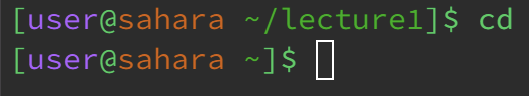

Week-1-Lab-Report\
By: Angelica Cabusi (A17948600)\
CSE15L Joseph Politz
=========
---

## `cd Commands`
__no arguments:__\

- Working directory when the command was run: **lecture1**\
The files system contains two directories, named _lecture1_ followed _messages_ (the messages directory is within the lecture1 directory), and within the messages directory, there are multiple text files,
a _Hello.class_ file, _Hello.java_ file, and a _READ ME_ file.
In the terminal, when using the cd command with no argument your changed directory defaults to the top directory (~), instead of a specific directory to input commands from, where it can only change to the next directory below it, which is the lecture1 directory
in this case.

__directory argument:__\

- Working directory when the command was run: **~**\
Unlike having no argument, where no path is linked with doing the cd command, by having a directory be an argument then the directory you are operating on will be changed to the specified directory in the argument.
However, this command only works for directories that are directly under the current directory because in the file system, in this case, the _messages_ directory is within the lecture1 directory so it cannot be
accessed from the ~ directory that is above the lecture1 directory.

__File argument:__\

- Working directory when the command was run: **lecture1/messages**\
In the filesystem, cy.txt is a text file within the messages directory, which is why the current directory to do this cd command with a file argument is changed to the messages directory(within the lecture1 directory) to avoid any confusion. But be it inside or outside the directory, the command will be bashed either way because the command to change directories(cd) cannot change to files such as the cy.txt text file.

## `ls Commands`
